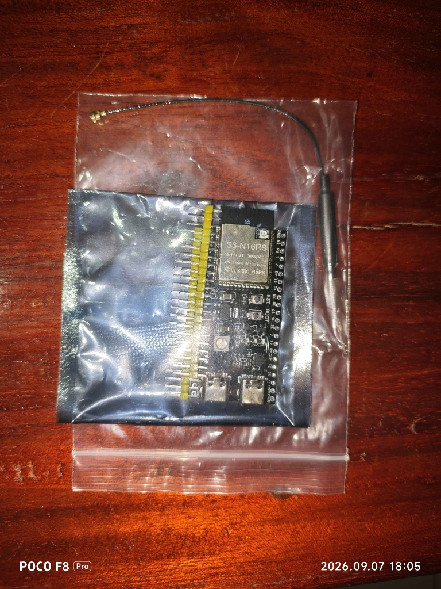
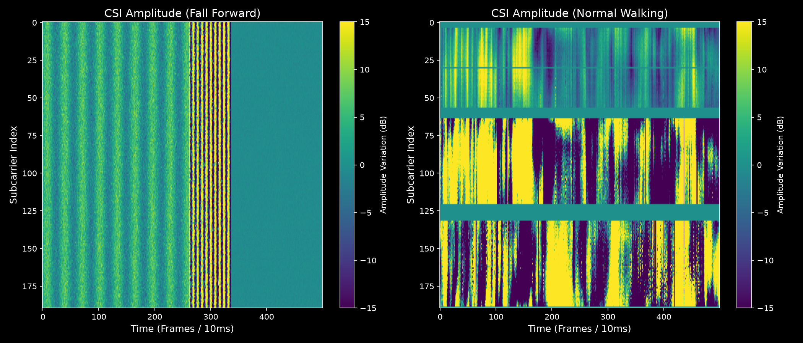
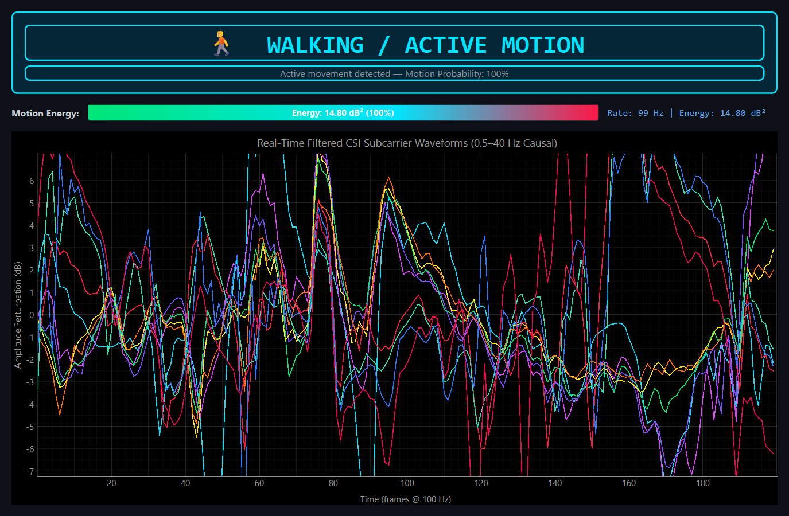

# ESP32-S3 WiFi CSI Fall Detection & Activity Monitoring System (Prototype)

[](https://www.python.org/)
[](https://pytorch.org/)
[](https://github.com/espressif/esp-idf)
[](https://www.espressif.com/en/products/socs/esp32-s3)
[](LICENSE)
[](docs/SG_PROJECT_DAY_KNOWLEDGE_BASE.md)

Device-free, privacy-preserving human activity classification and elderly fall detection prototype powered by 2.4 GHz WiFi Channel State Information (CSI) from dual ESP32-S3 microcontrollers and deep learning.

---

## Overview

Elderly falls represent a leading cause of fatal and non-fatal injuries worldwide. Conventional monitoring solutions suffer from fundamental trade-offs:
- **Optical Cameras**: Violate personal privacy, creating blind spots in private quarters such as bedrooms and bathrooms.
- **Wearable Sensors**: Require continuous user compliance (frequently forgotten, removed before sleep or bathing, or discharged).

This project implements an end-to-end wireless sensing system using **Channel State Information (CSI)** extracted from commodity **ESP32-S3** microcontrollers operating on 2.4 GHz WiFi (802.11n HT40). By tracking multi-path Doppler shifts and amplitude perturbations across 114 active subcarriers, the system detects human presence, classifies activities (walking vs. stationary rest), and identifies sudden falls in real time without requiring cameras, wearables, or ambient lighting.

<p align="center">
  
  <br />
  <em>Hardware deployment: Dual ESP32-S3 development boards equipped with 6 dBi omni-directional antennas.</em>
</p>

---

## System Architecture

```text
  [Transmitter (Tx) - COM5]                              [Receiver (Rx) - COM3]
  ESP32-S3 + 6 dBi Antenna                               ESP32-S3 + 6 dBi Antenna
  ┌─────────────────────────┐                            ┌─────────────────────────┐
  │ Broadcast 100 Hz Frames │                            │ Extract Raw CSI Payloads│
  │ Channel 6 (HT40 Mode)   │                            │ 190 Raw IQ Subcarriers  │
  └────────────┬────────────┘                            └────────────┬────────────┘
               │                                                      │
               ▼                                                      ▼
    [Wireless Multipath Channel]                              [Serial 921,600 Baud]
    Body movement modulates WiFi carriers                             │
    via Doppler shifts & scattering                                   ▼
                                                          [Decoupled Ring Buffer]
                                                          Zero-latency reader thread
                                                                      │
                                                                      ▼
                                                          [Uniform 100 Hz Resampler]
                                                          Bridges serial arrival jitter
                                                                      │
                                                                      ▼
                                                          [Hardware AGCFaultGuard]
                                                          Blocks PHY gain-switch steps
                                                                      │
                                                                      ▼
                                                          [Streaming Hampel Filter]
                                                          Median outlier suppression
                                                                      │
                                                                      ▼
                                                           [Causal SOS Bandpass]
                                                           0.5 - 40 Hz 8th-Order (4 SOS)
                                                                      │
                                                                      ▼
                                                          [Sliding Window: 1s (100×20)]
                                                          PCA & Standard Scaler
                                                                      │
                                                                      ▼
                                                          [CNN-BiLSTM + Attention]
                                                          Spatial + Temporal Inference
                                                                      │
                                            ┌─────────────────────────┴─────────────────────────┐
                                            ▼                                                   ▼
                                 [Real-Time Fall Engine]                             [Activity Monitor GUI]
                                 scripts/realtime_detect.py                          scripts/realtime_activity_demo.py
                                 Threshold: 80% | Audible Buzzer                     60 FPS Waveform + Motion Gauge
```

---

## Hardware Configuration

The system is deployed in a single-link bistatic transceiver topology:

| Parameter | Transmitter (Tx) | Receiver (Rx) | Notes |
|:---|:---|:---|:---|
| **Microcontroller** | ESP32-S3-WROOM-1 | ESP32-S3-WROOM-1 | Dual-core Xtensa LX7 @ 240 MHz |
| **Port** | `COM5` | `COM3` | Hardware UART bridge @ 921,600 baud |
| **Antenna** | 6 dBi External Omni Antenna | 6 dBi External Omni Antenna | Extended link budget & multipath sensitivity |
| **Power Source** | Dedicated 5V USB Wall Supply | Host PC USB 3.0 Port | Isolated Tx ground prevents noise coupling |
| **Firmware** | `esp-csi/.../csi_send` | `esp-csi/.../csi_recv` | Espressif ESP-CSI framework on ESP-IDF v5.4 |
| **WiFi Protocol** | 802.11n HT40 | 802.11n HT40 | 40 MHz channel bandwidth |
| **RF Channel** | Channel 6 (2437 MHz) | Channel 6 (2437 MHz) | Center frequency with secondary channel |
| **Packet Rate** | 100 Hz broadcast | ~60-65 Hz serial throughput | Governed by UART baud bandwidth limits |

### Physical Layout
```text
    [COM5 - Tx Node]                  Activity & Sensing Zone                [COM3 - Rx Node]
    ┌───────────────┐                                                        ┌───────────────┐
    │   ESP32-S3    │◄──────────────────────── 3 - 5 m ─────────────────────►│   ESP32-S3    │
    │ 6 dBi Antenna │             Direct Line-of-Sight (LoS)                 │ 6 dBi Antenna │
    └───────────────┘                   Fresnel Ellipsoid                    └───────────────┘
     Height: ~1.0 m                                                           Height: ~1.0 m
```

---

## Core Engineering Innovations

### 1. Hardware AGC Step Suppression (`AGCFaultGuard`)
At fringe signal levels, the ESP32 Wi-Fi PHY AGC switches internal analog gain stages (e.g. LNA/VGA steps 24 $\leftrightarrow$ 26). Because firmware gain compensation operates with a single-packet latency relative to analog switching, raw CSI amplitudes occasionally suffer instantaneous common-mode gain jumps across all subcarriers simultaneously (empirically $\approx \pm 6 \text{ dB}$, up to $+10$ to $+20 \text{ dB}$ under severe dithering).
- **The Solution**: An online metric tracking frame-to-frame log-ratio uniformity across subcarriers:
  $$\mu = \text{mean}\left(\log \frac{A_k[t]}{A_k[t-1]}\right), \quad \sigma = \text{std}\left(\log \frac{A_k[t]}{A_k[t-1]}\right)$$
  When $\sigma \approx 0$ (< 0.35) while $|\mu|$ is large (> 0.69 $\approx 6 \text{ dB}$), the frame is flagged as an artificial gain step and suppressed, preventing severe filter ringing.
- **Note**: `AGCFaultGuard` is currently deployed in the real-time Activity Monitor GUI and `dual_link.py`. The Fall Detection runtime uses `StreamingHampel` as its primary defense.

### 2. Streaming Hampel Filter (`StreamingHampel`, Low-Latency / Quasi-Causal)
Isolated packet corruptions and RF noise impulses act as step inputs to narrow IIR bandpass filters, causing impulse ringing.
- **The Solution**: A streaming sliding-window Hampel filter with bounded look-ahead delay (~50 ms at 100 Hz due to a centered $2k+1$ window) computing the rolling median and Median Absolute Deviation (MAD):
  $$\text{MAD} = 1.4826 \times \text{median}(|x - \text{median}(x)|)$$
  Outliers exceeding threshold $\times \text{MAD}$ are replaced with the local median prior to bandpass filtering, stabilizing the IIR state.

### 3. Butterworth SOS Bandpass (0.5 - 40 Hz, order=4 per edge → 8th-order, 4 biquads)
Human torso movement during a fall produces characteristic Doppler frequencies:
$$f_D \le \frac{2v}{\lambda} \approx 16 \text{ Hz per m/s} \implies 32 - 49 \text{ Hz theoretical upper bound for fall}$$
- Traditional 10 Hz low-pass filters eliminate the critical fall transient.
- Non-causal zero-phase filtering (`filtfilt`) cannot run in real time.
- **The Solution**: A stateful, causal 8th-order Butterworth band-pass implemented as 4 second-order sections (SOS). The 0.5 Hz high-pass edge removes static DC multipath from walls and furniture; the 40 Hz low-pass edge rejects high-frequency noise while preserving rapid fall signatures.

### 4. Leakage-Free Machine Learning Pipeline
Overlapping sliding windows extracted from time-series recordings share temporal information. Randomly partitioning windows into train/test sets contaminates test distributions, artificially inflating validation accuracy.
- **The Solution**: The dataset is segmented strictly at the recording session level using `GroupShuffleSplit` on `groups.npy`. Windows from any given physical recording session exist entirely in the training split or the test split, never both.
- **Note on Current Data**: Fall-class training data is currently synthetic (generated via `scripts/generate_synthetic_falls.py`). Walking/Sitting data is from real physical recordings. See [Limitations](docs/SG_PROJECT_DAY_KNOWLEDGE_BASE.md#9-ข้อจำกัดของโครงงาน-limitations).

---

## Deep Learning Architecture

The classification backbone combines spatial subcarrier feature extraction, temporal sequence dynamics, and multi-head self-attention:

```text
Input Tensor: Window of 100 samples × 20 PCA components (1.0 s @ 100 Hz)
  │
  ├──► 1D Convolution (64 filters, kernel=3)  + BatchNorm + ReLU + Dropout(0.2)
  ├──► 1D Convolution (128 filters, kernel=3) + BatchNorm + ReLU + MaxPool1D(2)
  │
  ├──► Bidirectional LSTM (hidden=128, 2 layers, dropout=0.3)
  │      Captures forward & backward temporal dynamics of posture transition
  │
  ├──► Multi-Head Self-Attention (4 heads, embed_dim=256)
  │      Dynamically weights critical impact frames over static pre/post phases
  │
  └──► Fully Connected Classifier (Linear 64 -> Linear 2)
         ├── Class 0: Fall (Alarm Triggered)
         └── Class 1: Normal Daily Activity (Walking, Sitting, Standing, Resting)
```

### Model Evaluation Results & Limitations

The evaluation pipeline is designed to emphasize the minority positive class (**Fall**) using **PR-AUC** and **ROC-AUC** to handle class imbalance.

**Current Evaluation Status**:
- **Evaluation Positioning**: **Proof-of-concept model evaluation** under zero-leakage conditions, **not yet a clinical real-world fall-detection accuracy benchmark**.
- **Checkpoint Validation Accuracy (by lowest val loss)**: **74.24%** (epoch 1, val loss = 0.4228; under strictly zero-leakage `GroupShuffleSplit`).
- **Peak Observed Validation Accuracy**: 78.79% (epoch 3; higher validation loss [1.23 vs 0.42] than the selected checkpoint, so it was not selected).
- **Inference Latency**: **< 3.2 ms** (real-time capable on NVIDIA RTX 3050 Laptop GPU / CPU).
- **AUC Metrics**: Not yet reportable — current test set contains only Fall-class samples (54 windows, test accuracy 42.6%). Robust PR-AUC and ROC-AUC require a multi-class test dataset.
- **Data Provenance**: Fall-class training samples are currently **synthetic** (generated by `scripts/generate_synthetic_falls.py` using a 3-phase kinematic fall model for human subject safety). Walking/Sitting samples are from real physical recordings. Physical cushioned falls (`data/raw/fall_*`) were captured for preliminary calibration and testing.

> **Note**: This project demonstrates a **working sensing prototype**, not clinical-grade accuracy. The evaluation script (`model/evaluate.py`) will automatically produce Confusion Matrices, ROC curves, and PR curves once a larger, multi-class test dataset with real fall recordings is collected.

### Raw CSI Data Visualization
Rather than presenting overfitted or synthetic evaluation curves, we visualize the actual physical data captured by our dual-ESP32 setup. The spectrograms below demonstrate the distinct physical signatures of a Fall versus Normal Walking:

<p align="center">
  
  <br />
  <em>Raw CSI Data: Notice the sharp, sudden amplitude disruption across all subcarriers during a fall (Left) compared to the periodic, low-frequency oscillations of normal walking (Right).</em>
</p>

> **Note**: The evaluation script (`model/evaluate.py`) is fully implemented to generate Confusion Matrices, ROC curves, and PR curves, and will automatically produce these artifacts once a larger, multi-class test dataset is collected.

---

## Real-Time Runtime Engines

The project provides two independent real-time applications:

### 1. Live Human Activity Monitor (`scripts/realtime_activity_demo.py`)
Provides an interactive 60 FPS graphical interface distinguishing active walking from stationary rest with a dynamic motion intensity gauge.

```powershell
python scripts/realtime_activity_demo.py --port COM3
```

<p align="center">
  
  <br />
  <em>Real-time Activity Monitor: 10 filtered subcarrier waveforms, live motion energy gauge (dB²), and glowing activity status banner.</em>
</p>

### 2. Real-Time Fall Detection Engine (`scripts/realtime_detect.py`)
Runs the full causal DSP chain and neural network inference every 250 ms, alerting upon fall detection with an audible buzzer.

```powershell
python scripts/realtime_detect.py --port COM3 --threshold 0.80
```

Terminal output:
```text
[20:45:12] Status: NORMAL   | Fall: [==------------------] 14.2% | Daily: 85.8% | 65 pkt/s
[20:45:14] Status: CHECKING | Fall: [==============------] 72.0% | Daily: 28.0% | 65 pkt/s
[20:45:15] Status: FALL!    | Fall: [====================] 94.6% | Daily:  5.4% | 65 pkt/s >> ALARM
```

---

## Repository Structure

```text
ESP-CSI/
├── assets/                      # Curated visual figures for documentation & presentation
│   ├── hardware_setup.jpg       # Dual ESP32-S3 boards with 6 dBi antennas
│   ├── realtime_demo.png        # Real-time Activity Monitor GUI screenshot
│   ├── confusion_matrix.png     # Model evaluation confusion matrix
│   ├── roc_curve.png            # ROC evaluation curve
│   ├── pr_curve.png             # Precision-Recall curve
│   └── walking_vs_sitting.png   # Spectral activity comparison
├── docs/
│   └── SG_PROJECT_DAY_KNOWLEDGE_BASE.md # Comprehensive engineering & presentation guide
├── esp-csi/                     # Espressif ESP-CSI submodule
│   └── examples/get-started/    # csi_send (Tx) and csi_recv (Rx) firmware
├── data/
│   ├── raw/                     # Raw CSI recordings (.csv) by activity category
│   │   ├── walking/             # Active walking datasets
│   │   ├── sitting_down/        # Stationary resting datasets
│   │   ├── standing_up/         # Sit-to-stand transition datasets
│   │   ├── empty_room/          # Background environment baseline
│   │   └── fall_*/              # Controlled cushioned fall datasets
│   └── processed/               # Preprocessed tensors (X.npy, y.npy, groups.npy, pipeline_state.pkl)
├── scripts/
│   ├── csi_dsp.py               # Shared Causal DSP engine (Hampel, SOS Bandpass, Resampler)
│   ├── parse_csi.py             # High-throughput serial parser & packet reader
│   ├── collect_csi.py           # Automated CSI data recording CLI with quality audit
│   ├── preprocess.py            # End-to-end signal preprocessing & sliding window pipeline
│   ├── visualize_csi.py         # 60 FPS real-time oscilloscope & spectral snapshot tool
│   ├── realtime_activity_demo.py # Live Walking vs Sitting classification monitor
│   └── realtime_detect.py       # Live Fall Detection runtime engine with buzzer alarm
├── model/
│   ├── cnn_lstm.py              # CNN-BiLSTM + Multi-Head Self-Attention model definition
│   ├── dataset.py               # Leakage-free PyTorch Dataset with GroupShuffleSplit
│   ├── train.py                 # GPU-accelerated training pipeline (CUDA 11.8)
│   ├── evaluate.py              # Fall-centric evaluation suite
│   └── saved/                   # Saved model checkpoints & training history
├── config.yaml                  # Unified hardware, DSP, and model parameters
├── requirements.txt             # Python environment dependencies
└── README.md                    # Project documentation
```

---

## Quickstart Guide

### 1. Environment Setup

```powershell
# Clone the repository
git clone https://github.com/Ken35943/SG_106B07.git
cd SG_106B07

# Create and activate virtual environment
python -m venv venv
.\venv\Scripts\Activate.ps1

# Install dependencies (Python 3.11 recommended)
pip install -r requirements.txt
```

### 2. Firmware Installation

Flash the precompiled binaries to both ESP32-S3 boards using `esptool`:

```powershell
# Flash Receiver (COM3)
python -m esptool --chip esp32s3 -p COM3 write_flash 0x0 esp-csi/examples/get-started/csi_recv/build/bootloader/bootloader.bin 0x8000 esp-csi/examples/get-started/csi_recv/build/partition_table/partition-table.bin 0x10000 esp-csi/examples/get-started/csi_recv/build/csi_recv.bin

# Flash Transmitter (COM5)
python -m esptool --chip esp32s3 -p COM5 write_flash 0x0 esp-csi/examples/get-started/csi_send/build/bootloader/bootloader.bin 0x8000 esp-csi/examples/get-started/csi_send/build/partition_table/partition-table.bin 0x10000 esp-csi/examples/get-started/csi_send/build/csi_send.bin
```

### 3. Verification & Live Oscilloscope

Verify live CSI frame reception across all 114 active subcarriers:

```powershell
python scripts/visualize_csi.py --port COM3
```

### 4. Data Collection & Training Workflow

```powershell
# 1. Collect calibrated activity recordings
python scripts/collect_csi.py --activity walking --duration 15 --port COM3
python scripts/collect_csi.py --activity sitting_down --duration 10 --port COM3
python scripts/collect_csi.py --activity fall_forward --duration 10 --port COM3

# 2. Run signal preprocessing pipeline
python scripts/preprocess.py

# 3. Train neural network on GPU
python model/train.py --epochs 30 --batch-size 32

# 4. Generate evaluation metrics & plots
python model/evaluate.py
```

---

## Troubleshooting & Engineering Notes

| Symptom | Root Cause | Resolution |
|:---|:---|:---|
| **Stale Serial Backlog / Packet Lag** | Structural oversubscription: 921,600 baud carries ~92 kB/s while Tx broadcasts at 100 Hz (~150 kB/s). | Handled automatically by decoupled ingestion threads and high-watermark serial buffer purging (64 kB threshold). |
| **Periodic Common-Mode Gain Spikes (~±6 dB to +10 dB)** | ESP32 internal PHY AGC switches gain steps (24 $\leftrightarrow$ 26) with 1-packet compensation lag. | Suppressed via `AGCFaultGuard` and `StreamingHampel` prior to the IIR bandpass filter. |
| **Halved Frame Rate (30 Hz instead of 65 Hz)** | Aggressive serial buffer flushing (`in_waiting > 4096`) discarding valid packet frames. | Purge threshold raised to 64 kB (`scripts/realtime_activity_demo.py`), preserving contiguous packets. |
| **All Predictions Report NORMAL** | `realtime_detect.py` is a binary fall classifier; walking is defined as Daily Activity (Normal). | Normal behavior. To observe live motion sensitivity, run `scripts/realtime_activity_demo.py` or simulate falls with `--threshold 0.50`. |

---

## Documentation & Project Information

- **Complete Knowledge Base & Presentation Guide**: See [docs/SG_PROJECT_DAY_KNOWLEDGE_BASE.md](docs/SG_PROJECT_DAY_KNOWLEDGE_BASE.md) for an exhaustive technical report covering RF physics, mathematical derivations, real-world engineering hurdles, and defense presentation scripts.
- **Academic Context**: Saint Gabriel's College — **SG Project Day 2026** (Project SG_106B07).
- **Core Frameworks**: [Espressif ESP-CSI](https://github.com/espressif/esp-csi), [PyTorch](https://pytorch.org/), [PyQtGraph](https://www.pyqtgraph.org/).
